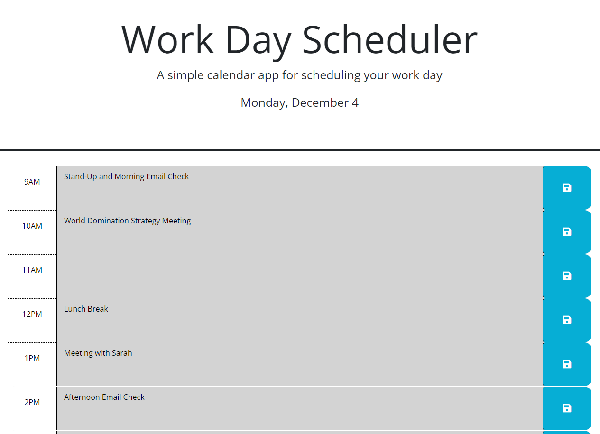

# Daily Planner

## Description

As a full-time student and full-time employee, time management is essential to keeping myself on the right track. However, a lot of calendar applications have a number of bells and whistles, and what better way to practice some new JavaScript techniques than to create a planner myself? Utilizing JQuery, dayJS, BootStrap, and integrating my knowledge of Local Storage, I was able to create a sleek, simple, and easily usable daily planner webpage. After learning about all those tools, taking some time and then coming back to attempt this project will definitely help me retain the syntax.

## Installation

[Access the website by clicking here!](https://redknight88.github.io/daily-planner/index.html)

## Usage

The planner is structured for a normal 9am through 5pm workday, with the current day at the top of the page in case your morning routine went a little bit of course. Depending on the time of day, the page will highlight certain timeblocks different colors (gray if it has already passed, red for current, and green for future). The blocks all contian a section to type out different events or action items to keep track of, as well as a button that saves the written text into the local storage. Exiting out of the page or refreshing will not lose any data, as long as the save buttons are pressed after entering the text. Because of the integration with dayJS, the page will update to the current date and time when refreshed, or if run on a live server, will update automatically.

